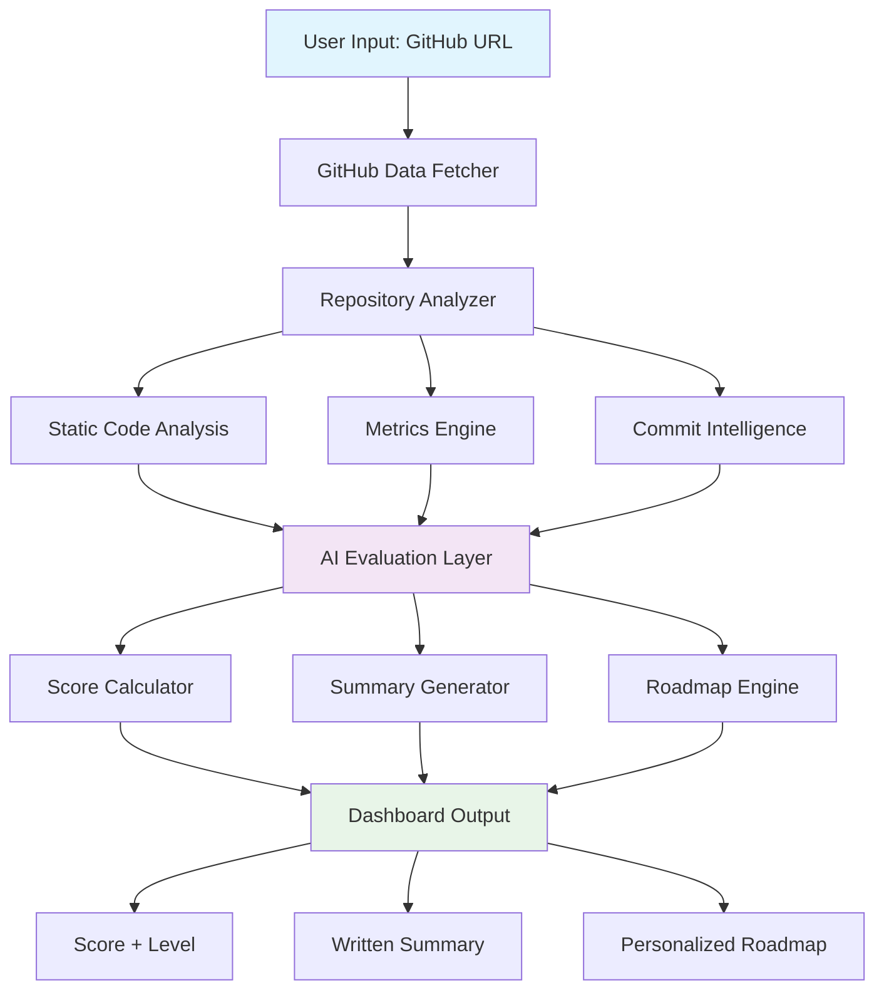

# Repository Mirror 🪞 (DEMO LINK: https://youtu.be/6Zy-ZVKMug4)


> **"Your GitHub is already speaking. We just translate it."** 🚀

An AI-powered system that analyzes public GitHub repositories and converts them into **Score + Summary + Personalized Roadmap**, just like a coding mentor or recruiter would.

[](https://opensource.org/licenses/MIT)
[](https://www.python.org/downloads/)
[](https://fastapi.tiangolo.com)

---

## 🚀 Problem We Solve

Students and developers push code to GitHub but rarely know:
- How clean their code actually looks to recruiters
- Whether their project feels "real-world" ready
- What exactly to improve next for career growth

**Repository Mirror** reflects the *true quality* of repositories using automated analysis + AI reasoning, providing actionable feedback that transforms GitHub profiles into powerful career assets.

---

## 🏗️ System Architecture



---

## 🎯 Core Features

### 📊 **Multi-Dimensional Scoring**
| Dimension | Weight | Description |
|-----------|--------|-------------|
| Code Quality & Readability | 25% | Complexity, formatting, best practices |
| Project Structure | 15% | Modularity, organization, architecture |
| Documentation | 15% | README quality, code comments, guides |
| Tests & Maintainability | 15% | Test coverage, CI/CD, error handling |
| Real-World Relevance | 20% | Features, scalability, production-readiness |
| Git Practices | 10% | Commit quality, branching, collaboration |

### 🎖️ **Level Classification**
- **🟤 Beginner (0-40)**: Learning fundamentals
- **🟡 Intermediate (41-70)**: Building solid projects  
- **🟢 Advanced (71-85)**: Industry-ready code
- **🔵 Production-Ready (86-100)**: Professional quality

### 🧠 **AI-Powered Analysis**
- **Role-Based Evaluation**: Frontend, Backend, Full-Stack, ML Engineer
- **Industry Readiness Tags**: Academic → Portfolio → Internship → Job Ready
- **Skill Heatmap**: Visual representation of demonstrated technologies
- **Commit Intelligence**: Analyzes development patterns and practices

---

## 🔍 Data Collection & Analysis

### GitHub API Integration
```python
# Core metrics collected
{
    "structure": "folder depth, modularity, file organization",
    "code_quality": "complexity, linting, formatting consistency", 
    "documentation": "README completeness, code comments",
    "testing": "test files, frameworks, coverage indicators",
    "commits": "frequency, message quality, development patterns",
    "stack": "languages, frameworks, dependencies",
    "practices": "branching strategy, PR usage, collaboration"
}
```

### Smart Analysis Features
- **README Quality Analyzer**: Breaks down documentation into scored sections
- **Code Smell Detection**: Identifies large files, long functions, duplicates
- **Commit Pattern Analysis**: Evaluates development consistency and quality

---

## 🗺️ Personalized Roadmap Engine

### Progressive Learning Path
```
Week 1: Foundation
├── Add comprehensive README with setup instructions
├── Implement basic error handling
└── Create project structure documentation

Week 2: Quality & Testing  
├── Write unit tests for core functionality
├── Set up linting and formatting
└── Add input validation

Week 3: Production Readiness
├── Implement CI/CD pipeline
├── Add environment configuration
└── Create deployment documentation
```

### Role-Specific Recommendations
- **Frontend**: Accessibility, responsive design, performance optimization
- **Backend**: API documentation, database design, security practices
- **Full-Stack**: Integration testing, deployment strategies, monitoring
- **ML Engineer**: Data validation, model versioning, experiment tracking

---

## 🛠️ Tech Stack

| Layer | Technology | Purpose |
|-------|------------|---------|
| **Backend** | Python + FastAPI | API server, analysis engine |
| **GitHub Integration** | REST/GraphQL API | Repository data fetching |
| **Code Analysis** | Radon, ESLint, Pylint | Static code analysis |
| **AI Layer** | LLM Integration | Evaluation and roadmap generation |
| **Frontend** | React/Next.js | User interface |
| **Database** | PostgreSQL | Analysis history, user data |
| **Deployment** | Docker + GitHub Actions | Containerization and CI/CD |

---

## 🚀 Getting Started

### Prerequisites
- Python 3.8+
- Node.js 16+
- GitHub Personal Access Token

### Installation
```bash
# Clone the repository
git clone https://github.com/yourusername/repository-mirror.git
cd repository-mirror

# Backend setup
pip install -r requirements.txt
cp .env.example .env  # Add your GitHub token

# Frontend setup
cd frontend
npm install

# Run the application
npm run dev  # Frontend (port 3000)
python main.py  # Backend (port 8000)
```

### Quick Usage
```bash
# Analyze a repository
curl -X POST "http://localhost:8000/analyze" \
  -H "Content-Type: application/json" \
  -d '{"repo_url": "https://github.com/user/repo"}'
```

---

## 📈 Advanced Features

### 🎯 **Resume ↔ GitHub Alignment**
- Compare claimed skills on resume with repository evidence
- Identify skill gaps and provide targeted recommendations
- Generate alignment score for job applications

### 📊 **Repo Comparison Mode**
- Benchmark against industry standards
- Compare multiple repositories side-by-side
- Track improvement over time

### 🤖 **Recruiter Simulation**
- Different perspectives: Startup vs Big Tech vs Open Source
- Role-specific evaluation criteria
- Interview-ready talking points generation

---

## 🎨 Sample Output

```json
{
  "score": 78,
  "level": "Advanced",
  "summary": "Well-structured React application with clean component architecture. Strong documentation and consistent Git practices. Missing comprehensive testing and error handling reduces production readiness.",
  "skills_demonstrated": {
    "React": 9,
    "JavaScript": 8,
    "CSS": 7,
    "Git": 8,
    "Testing": 3
  },
  "roadmap": [
    "Add Jest testing framework with 70%+ coverage",
    "Implement error boundaries and loading states", 
    "Add TypeScript for better type safety",
    "Set up GitHub Actions for automated testing"
  ],
  "role_fit": {
    "frontend_developer": 85,
    "full_stack_developer": 72
  }
}
```

---

## 🔮 Future Enhancements

- **🎯 Job Role Matching**: Align repositories with specific job requirements
- **📊 Portfolio Analytics**: Track GitHub profile improvement over time  
- **🤝 Team Collaboration**: Analyze team repositories and contribution patterns
- **🏆 Achievement System**: Gamify repository improvement with badges and milestones
- **📱 Mobile App**: On-the-go repository analysis and recommendations

---

## 🤝 Contributing

We welcome contributions! Please see our [Contributing Guide](CONTRIBUTING.md) for details.

1. Fork the repository
2. Create a feature branch (`git checkout -b feature/amazing-feature`)
3. Commit your changes (`git commit -m 'Add amazing feature'`)
4. Push to the branch (`git push origin feature/amazing-feature`)
5. Open a Pull Request

---

## 📄 License

This project is licensed under the MIT License - see the [LICENSE](LICENSE) file for details.

---

## 🙏 Acknowledgments

- GitHub API for repository data access
- Open source static analysis tools
- The developer community for inspiration and feedback

---

<div align="center">

**Repository Mirror** is not a judge — it's a mentor.  
*It tells developers where they stand and exactly how to level up.*

[🌟 Star this repo](https://github.com/yourusername/repository-mirror) | [🐛 Report Bug](https://github.com/yourusername/repository-mirror/issues) | [💡 Request Feature](https://github.com/yourusername/repository-mirror/issues)

</div>
